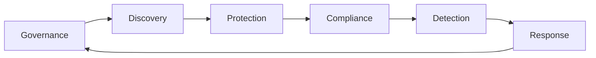

# 07 Cybersecurity - Data Security

This wiki transforms the data security transcript into a simple, easy-to-read GitHub Wiki.

The content is organized around the main data security lifecycle:

## Key Messages

- Data breaches are expensive.
- Most organizations are hit more than once.
- You cannot protect data you have not discovered.
- Encryption is important, but key management is equally important.
- Compliance is not optional if you handle regulated data.
- Detection and response must be part of the design, not an afterthought.
- People are often the weakest link, so training matters.

## Pages

| Page | Purpose |
|---|---|
| [Home](Home) | Main landing page for the data security wiki |
| [Series Overview](Series-Overview) | Context for where this topic fits in the series |
| [Governance and Discovery](Governance-Discovery) | Policy, classification, data catalog, DLP, structured and unstructured data |
| [Protection and Compliance](Protection-Compliance) | Encryption, keys, access control, backups, GDPR, HIPAA, retention |
| [Detection and Response](Detection-Response) | Monitoring, UBA, alerts, playbooks, orchestration, automation |
| [Top 5 Breach-Reduction Actions](Top-5-Breach-Reduction) | Top five actions from the breach survey |
| [Sources](Sources) | References and source notes |

## How to Use This Wiki

1. Start with [Home](Home).
2. Read [Series Overview](Series-Overview) for context.
3. Work through the three main topic pages:
   - [Governance and Discovery](Governance-Discovery)
   - [Protection and Compliance](Protection-Compliance)
   - [Detection and Response](Detection-Response)
4. Finish with [Top 5 Breach-Reduction Actions](Top-5-Breach-Reduction).
